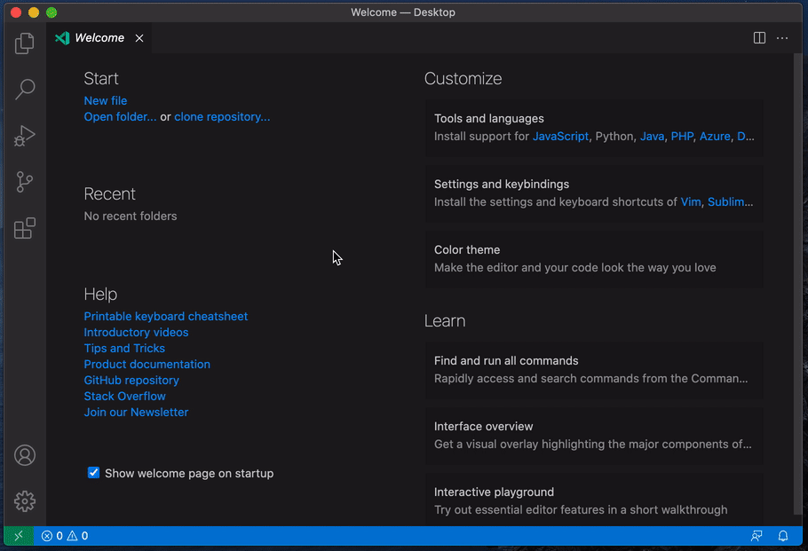

# evernote-search VSCode Exetension

This extension enables you to search notes in Evernote.

## Features

Open command palette, then run `Evernote Search`.



## Requirements

You need Evernote Developer token. You can get it from <https://sandbox.evernote.com/api/DeveloperToken.action>.  
Developer token has to be saved like

```ini
[settings]
EVERNOTE_TOKEN = YOUR_DEV_TOKEN
```

in `$HOME/.evernote-search.cfg`.

## Extension Settings

Currently, no settings are available.

## Known Issues

..

## Release Notes

See [CHANGELOG.md](CHANGELOG.md)

..
